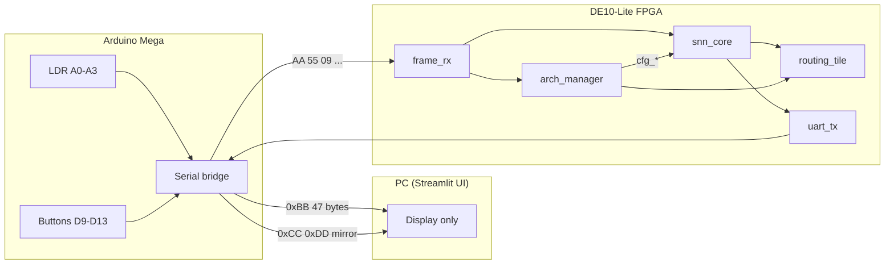
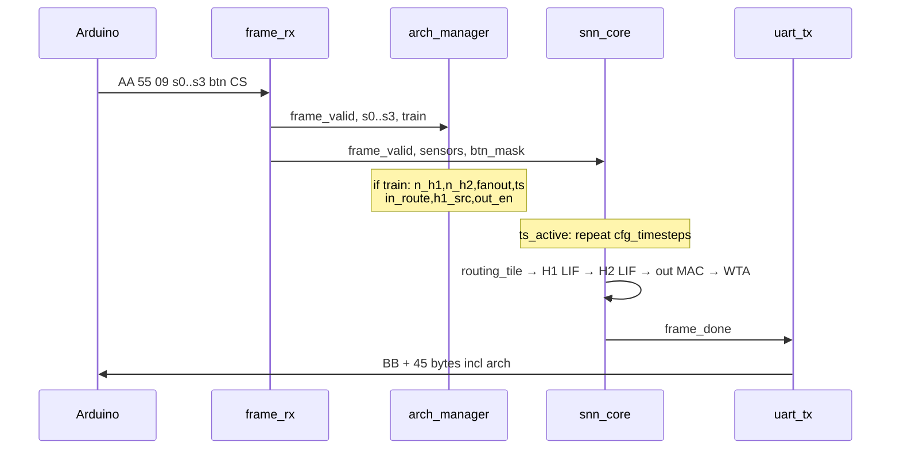
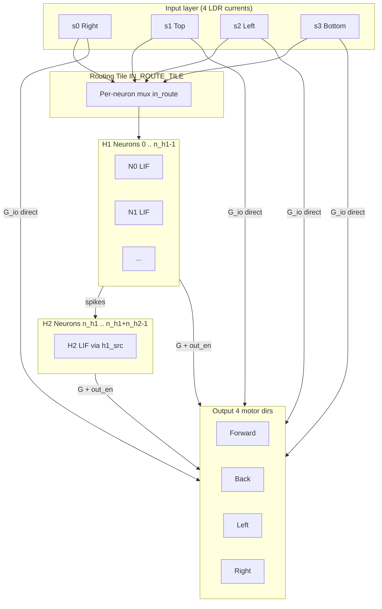

# Neuromorphic Light-SNN FPGA: Architecture and RTL Reference

A complete reference for the on-chip reconfigurable spiking neural network: neurons, synapses, Mosaic-style tiles, routing, and all RTL modules.

---

## 1. System overview

| Layer | Role |
|--------|------|
| **Arduino** | Reads LDRs and buttons; sends one **sensor frame** approximately every 10 ms to the FPGA and mirrors a copy to the PC. |
| **FPGA** | Parses the frame, **mutates architecture** when TRAIN is asserted, runs the **SNN** for `timesteps` cycles, and sends telemetry. |
| **PC UI** | Displays sensors and **architecture read from the FPGA** (bytes 43–46 of the `0xBB` packet). Architecture search is not computed in Python. |

### Two mechanisms of adaptation

| Mechanism | What changes | When | Module |
|-----------|--------------|------|--------|
| **Architecture reconfig** | Neuron count, routes, fanout, timesteps | TRAIN + LDR statistics, on each valid frame while TRAIN is held | `arch_manager` |
| **Synaptic learning** | Weight values `G`, `G_io` (memristor conductance) | TRAIN + direction button + sufficient light | `snn_core` |

---

## 2. Mosaic concept and RTL mapping

The Mosaic literature describes physical chips: memristor crossbars, analog MAC, and router tiles in a 2D mesh. On the DE10-Lite, that structure is **emulated in digital logic**:

| Mosaic concept | Physical idea | RTL implementation |
|----------------|---------------|----------------------|
| **Neuron Tile (N)** | LIF at column ends; 1T1R cells store weights; analog MAC | `snn_core`: `v_mem_h[]`, `v_mem_o[]`, arrays `G[][]`, `G_io[][]`, multiply-add loops |
| **Routing Tile (R)** | Reconfigurable crossbar routes spikes between tiles | `routing_tile` plus `in_route`, `h1_src`, `out_en` from `arch_manager` |
| **Synaptic weight** | Memristor conductance G | `reg [7:0] G[i][j]`, `G_io[k][j]` |
| **Spike → row voltage → MAC → column current → LIF → spike out** | Analog pipeline | Digital: `current[]` → routing → integrate → threshold → `h_spike` → weighted sum → `v_mem_o` |

The design does not instantiate a separate 2D mesh of tile modules. A **single** `snn_core` implements a folded N-tile and R-tile system controlled by configuration registers.

---

## 3. Neuron–synapse connection

### 3.1 Conceptual model

1. The **presynaptic** element sends a signal (spike or input current).
2. The **synapse** scales that signal by weight (conductance G).
3. The **postsynaptic** neuron integrates incoming scaled signals into membrane voltage V.
4. If V crosses threshold, the postsynaptic neuron **spikes**.

### 3.2 Digital RTL equivalent

**Synapse:** weighted multiply (and accumulate).  
**Neuron:** membrane register, leak, threshold, refractory period.

`snn_core.v` defines **two synapse types**:

#### A) Sensor → output (direct path), weights `G_io[4][4]`

For each output neuron `j`, sensor currents are multiplied by `G_io[i][j]`, summed, and shifted (`IO_MUL_SHIFT`). The presynaptic signal is normalized LDR **current** (graded, not strictly binary). The postsynaptic element is output neuron `j` (`v_mem_o[j]`).

#### B) Hidden → output, weights `G[32][4]`

If hidden neuron `i` spiked (`h_spike_next[i]`), contribution `G[i][j] >> H_TO_O_SHIFT` is added only when `cfg_out_en[i][j]` is set (fanout mask). This gates which hidden→output synapses are active.

#### C) Hidden stage 1 (H1): sensor current → LIF

H1 neurons do not use a separate `G` matrix for input. Input is **routed current** from `routing_tile` (`routed_current[i]`). The connection is determined by `in_route`, not by a learned weight.

#### D) Hidden stage 2 (H2): H1 spike → H2 LIF

H2 neuron `i` (with `i >= n_h1`) receives fixed current `H2_SPIKE_CUR` when H1 neuron `cfg_h1_src[i]` spiked. This models inter-tile spike routing in digital form.

### 3.3 LIF dynamics (hidden and output)

Each timestep:

- **Leak:** subtract `LEAK_H` or `LEAK_O` from membrane voltage.
- **Integrate:** add input or synaptic current.
- **Fire:** if voltage ≥ threshold (`V_THRESH_H` = 120 for hidden, `V_THRESH_O` = 200 for output), emit spike, reset voltage, start refractory counter.

Output neurons combine synaptic input and apply **winner-take-all** to produce `dir_bits` (motor direction).

### 3.4 Memristor learning (weights, not topology)

On the final timestep of a frame, when TRAIN is set and a direction button (Front/Back/Left/Right) is pressed with sufficient sensor current:

- The brightest sensor path to the selected direction is set to `G_MAX`.
- Other sensor paths to that direction are set to `G_MIN`.

This updates `G_io` only in the current implementation; hidden→output `G[][]` is not modified in that training block.

---

## 4. End-to-end signal flow (one sensor frame)

**Per-frame timeline:**

1. **First valid frame:** capture LDR baseline only; no SNN update.
2. **Subsequent frames:** start inner loop `ts_active` for `cfg_timesteps` clock cycles.
3. **Each timestep:** update H1 → H2 → outputs.
4. **Last timestep:** latch `dir_bits`; optionally update `G_io` if training conditions are met.
5. **`frame_done`:** top level packs UART telemetry including membranes, spikes, and architecture bytes.

---

## 5. Reconfigurability

Runtime reconfiguration changes **network wiring and temporal depth** without resynthesizing the bitstream.

### 5.1 Architecture registers (`arch_manager`)

| Register | Meaning | Hardware effect |
|----------|---------|-----------------|
| `n_h1` | Stage-1 hidden neuron count (indices `0 .. n_h1-1`) | Only these indices receive `routed_current[i]`; routing tile enables destinations `0 .. n_h1-1` |
| `n_h2` | Stage-2 hidden count (indices `n_h1 .. n_h1+n_h2-1`) | H2 update logic applies only in that range |
| `fanout` | Maximum downstream output links per hidden neuron | At most `fanout` ones per row in `out_en[i][*]` |
| `timesteps` | Integration steps per Arduino frame | Inner loop length before `frame_done` |

**Constraint:** `n_h1 + n_h2 ≤ 32` (fixed physical neuron slots).

### 5.2 Routing configuration arrays

Updated when `frame_valid && train`:

#### `in_route[0:31]` — Routing tile (sensors → H1)

Default assignment: `in_route[idx] = idx % 4` (neuron `idx` listens to sensor `idx mod 4`).

`routing_tile` implements one multiplexer per destination: H1 neuron `d` receives one of four sensor currents selected by 2-bit `in_route[d]`. Destinations `d >= n_h1` are forced to zero.

#### `h1_src[0:31]` — H1 → H2 routing

For H2 index `idx` where `idx >= n_h1`:

`h1_src[idx] = (idx - n_h1) % n_h1`

H2 neuron receives input when the mapped H1 neuron spiked.

#### `out_en[32][4]` — Fanout mask (hidden → outputs)

For each active hidden index `idx`, up to `fanout` outputs are enabled at positions `(idx + fo) % N_OUT` for `fo = 0 .. fanout-1`.

### 5.3 Light-driven mutation policy

Sensor mapping (Arduino / `arch_manager`):

- `s0` = Right (A0)
- `s1` = Top (A1)
- `s2` = Left (A2)
- `s3` = Bottom (A3)

Derived quantities:

- `brightness` = mean of s0..s3
- `horizontal` = right − left
- `vertical` = top − bottom

| Condition | Parameter change |
|-----------|------------------|
| Mean brightness > 650 | `n_h1 += 2` |
| Mean brightness < 350 | `n_h1 -= 2` |
| \|top − bottom\| > 120 | `n_h2 += 1` |
| \|right − left\| > 150 | `fanout += 1` |
| Brightness > 760 | `timesteps += 1` |
| Brightness < 260 | `timesteps -= 1` |

Focused light on one sensor tends to increase vertical imbalance (`n_h2`); uniform bright illumination tends to increase mean brightness (`n_h1`). Mutation occurs on **each** valid frame while TRAIN is held (sensor frame rate ~100 Hz), not only on a single button edge.

---

## 6. Logical tile wiring

The 32 hidden slots form a **pipeline** rather than a physical 2D Mosaic mesh:

In `snn_top_uart.v`, `arch_manager` drives `in_route`, `h1_src`, and `out_en` into `snn_core` as `cfg_*` signals. `routing_tile` is instantiated inside `snn_core` and uses `cfg_in_route` on every timestep.

---

## 7. RTL module reference

### `snn_top_uart.v` — Top module `snn_car`

- **Pins:** `clk`, `rst`, `uart_rx`, `uart_tx`, `leds[9:0]`.
- **Hierarchy:** `uart_rx` → `frame_rx` → `arch_manager` + `snn_core` → `uart_tx`.
- **Transmit:** 47-byte packet on `core_done`; payload bytes 43–46 carry `n_h1`, `n_h2`, `fanout`, `timesteps`.
- **LEDs:** direction bits, `arch_updated`, `frame_done`, `frame_valid`, TRAIN, UART activity, heartbeat.

### `uart_rx.v` / `uart_tx.v`

- 115200 baud, 8N1, 50 MHz clock.
- RX: one byte per cycle with `valid`.
- TX: `data` + `valid`; `ready` when idle.

### `frame_rx.v` — Ingress parser

- Sequence: `AA` → `55` → `09` → 9 payload bytes → XOR checksum.
- Outputs: `s0..s3` (12-bit), `btn_mask`, one-cycle `frame_valid`.
- **btn_mask:** bit 0 = TRAIN (D9), 1 = Left, 2 = Right, 3 = Front, 4 = Back.

### `arch_manager.v` — Architecture and route programming

- **Inputs:** `frame_valid`, `train`, sensors `s0..s3`.
- **Outputs:** `n_h1`, `n_h2`, `fanout`, `timesteps`, `in_route[]`, `h1_src[]`, `out_en[][]`, `arch_updated`.
- Contains no neuron dynamics; configuration registers and mutation policy only.

### `routing_tile.v` — R-tile crossbar (analog currents)

- Four sources, up to 32 destinations; per-destination 2-bit select.
- `n_active` disables destinations beyond `n_h1`.

### `snn_core.v` — Neuron tile and computation

- **State:** membranes, refractory, baselines, `G[32][4]`, `G_io[4][4]`.
- **Configuration:** all `cfg_*` from `arch_manager`.
- **Outputs:** spikes, membrane monitors, `frame_done`.
- Instantiates `routing_tile` as `IN_ROUTE_TILE`.

### `mega_snn_bridge.ino` — Host bridge (Arduino)

- Analog inputs A0–A3; buttons D9–D13.
- To FPGA: `AA 55 09` + payload + checksum @ 115200 on Serial1.
- To PC: `CC DD` mirror; forwards `0xBB` packets from FPGA.

---

## 8. UART protocol

### Arduino → FPGA (13 bytes)

| Bytes | Content |
|-------|---------|
| 0–1 | `AA 55` sync |
| 2 | `09` length |
| 3–10 | s0, s1, s2, s3 (12-bit each), btn_mask |
| 11 | XOR checksum of bytes 3–10 |

### FPGA → host (47 bytes)

| Index | Content |
|-------|---------|
| 0–1 | `BB`, `45` (payload length) |
| 2–33 | Hidden membrane V[0..31] (8-bit each) |
| 34–37 | Output membrane V[0..3] |
| 38–41 | Hidden spike bitmap (32 bits, little-endian) |
| 42 | `dir_bits` (output / motor direction) |
| 43 | `n_h1` |
| 44 | `n_h2` |
| 45 | `fanout` |
| 46 | `timesteps` |

### Arduino → PC (12 bytes, mirror)

| Bytes | Content |
|-------|---------|
| 0–1 | `CC DD` |
| 2–10 | Same 9-byte payload as FPGA RX |
| 11 | XOR checksum |

---

## 9. Fixed vs runtime-configurable

| Fixed at synthesis | Configurable at runtime |
|--------------------|-------------------------|
| Maximum 32 hidden slots | Active count: `n_h1`, `n_h2` |
| 4 inputs, 4 outputs | Sensor→H1 mapping (`in_route`) |
| LIF thresholds, leak | H1→H2 mapping (`h1_src`) |
| Physical size of `G`, `G_io` arrays | Hidden→output connectivity (`out_en`) |
| | Timesteps per frame |
| | `G_io` values during supervised training |

Adding a 33rd hidden neuron requires changing `N_H` and resynthesizing. Using fewer neurons and different routes is supported every frame while TRAIN is asserted.

---

## 10. Summary

**Neuron–synapse link:** A synapse is a weight (`G` or `G_io`) times a presynaptic signal (sensor current or hidden spike), summed into the postsynaptic membrane; the neuron applies leak, integration, threshold, and refractory behavior.

**Reconfigurability:** `arch_manager` updates network size, temporal depth, and three routing tables from LDR statistics while TRAIN is high. `snn_core` applies that configuration immediately in the timestep loop.

**Tiles:** The Mosaic neuron tile corresponds to `snn_core` (LIF + weights). The routing tile corresponds to `routing_tile` plus `h1_src` and `out_en`, programmed by `arch_manager`. All modules connect under `snn_top_uart.v` as the chip top level.

---

## Related files

| File | Description |
|------|-------------|
| `rtl/snn_top_uart.v` | Top-level integration |
| `rtl/snn_core.v` | SNN computation |
| `rtl/arch_manager.v` | Architecture search / routing maps |
| `rtl/routing_tile.v` | Sensor→H1 crossbar |
| `rtl/frame_rx.v` | UART frame parser |
| `RECONFIG_FPGA.md` | Build and program notes |
| `neuromorphic_light_nas_live_ui/` | PC dashboard (FPGA telemetry) |
